# SPSProfessional.SharePoint.WebParts.ActionDataBase
**ActionDatabase WebParts** is a set of webparts to connect quickly and effortlessly with your Back-End DataBase, as alternative to Business Data Catalog.

Click to show video

[](https://www.youtube.com/watch?v=3sn8vO3GhNA)


ActionGrid
----------

The **ActionGrid** WebPart displays data from a DataBase: with a simple "select command", the configuration of columns, headers and formats as presented on screen

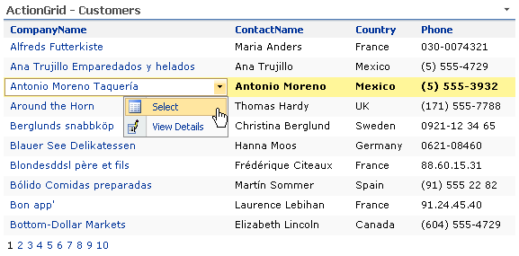

The **ActionGrid** also connects with other WebParts to create Master-Detail grids or connect with a form WebPart to filter data

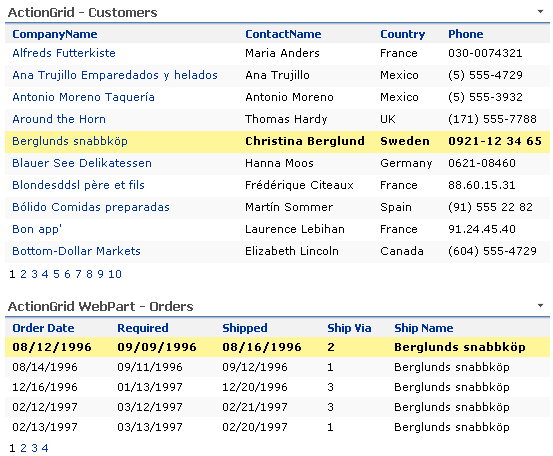

ActionDataBaseEditor
--------------------

Connect the **ActionGrid** WebPart with the **ActionEditor** WebPart and take full control to create, edit, update and delete data

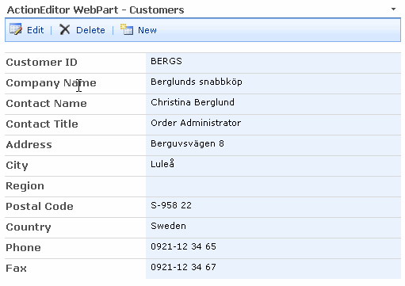

Full editing control

*   Fully customizable Tool Bar
*   Lookup fields, DropDownList and AJAX Picker Dialog
*   Date and DateTime fields controls
*   Fields validations (Required, Range, Regular Expression, Comparison)
*   Rich Text format fields
*   MOSS and WSS support !!!

Video

[](https://www.youtube.com/watch?v=GO7oKl4hx4s)


*ActionDataBaseGrid**

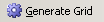

\- Click on the "Generate Grid" icon, the file configuration of the grid will be generated and you will be guided to the "XML Grid" results tab

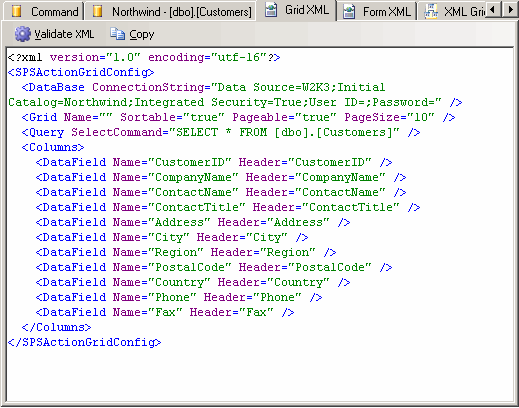

\- If you wish you can edit this part directly in the XML configuration file or if you prefer you can use the advanced editor on the "XML Grid Editor" tab

\- You can use the "Validate XML" icon to validate the XML configuration file if you have chosen to modify it by hand, in this case, if there are any errors these errors will be displayed on the"Errors" tab.

\- There is an icon "Copy" to copy the configuration file content to the clipboard.

\- We will use this icon.

\- We will go to SharePoint and we will create a new webparts page.

\- We will Add the el webpart **_ActionDataBaseGrid_**

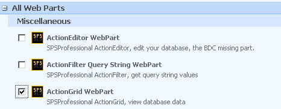

\-Once the web part is added to our site we have to configure it.

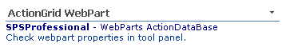

\- For which we can use the link **"Check webpart properties in tool panel"**

\- showing the properties panel

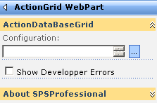

\- Click the icon to the right of the configuration box to paste the XML contents that we have previously generated with the generator.

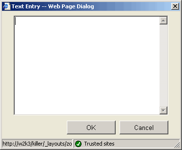

\- Once the XML configuration is pasted, press Ok and then accept the changes.

\- We will have our first **ActionDataBaseGrid** running.

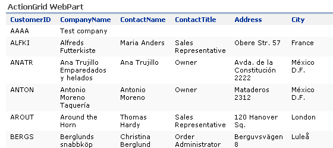

Next we will configure an **ActionDataBaseEditor** to edit data from the"Customers" table.

\- Returning to the generator from the "Command" tab

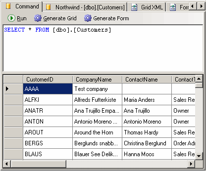

\- Click on "Generate Form" icon

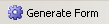

\- The **ActionDataBase Generator** will generate the necessary and basic XML configuration file to edit the table that we are using, in this case "Customers". You can modify the XML configuration file using the 'Form XML "tab or using the "XML Form Editor " advanced editor.

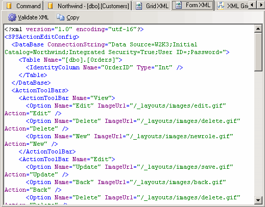

\- If you decide to use the advanced editor you need to remember that after publishing you should click the "Generate XML" icon to update the XML configuration.

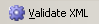

\-Once we have the code we only have to paste it into the **_ActionDataBaseEditor_** configuration like we did with the **_ActionDataBaseGrid_**

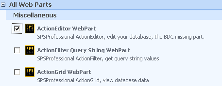

\- By default the **ActionDataBaseEditor** will not display any data it will only show a blank form.

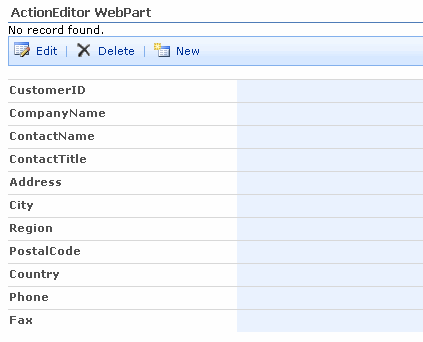

\- This is a normal behavior, as to be able to show a record, the **_ActionDataBaseEditor_** must be connected to another webpart to obtain identifying data from the register that you want to view or edit.

This section contains various fields that will be displayed in the editor as well as the controls in which they will be displayed and the verifications that are required for each of them.

The structure is as follows (sample):  

```
<Fields\>  
<Field Name\="Freight"  
Title\="Freight"  
Type\="Money"  
Control\="TextBox"  
Required\="true"  
DefaultValue\=""  
DisplayFormat\=""  
New\="Enabled"  
Edit\="Enabled"  
View\="Enabled"\>  
<TextBox Columns\="20" RightToLeft\="true" />  
<Validators\>  
<Validator Type\="Range"  
DataType\="decimal"  
MaxValue\="10000"  
MinValue\="0"  
ErrorMessage\="Number between 0 - 10000" />  
</Validators\>  
</Field\>  
...  
</Fields\> 
```


### Fields – Section for the fields that will conform the editor

Example

```<Fields\> <Field ... /> </Fields\>```

### Field – Element for each editor’s field

**Attributes:**  
**Name** -  (string) – Field’s name  
**Title** -  (string) - Title, description   
**Type** - (string)  -  (SQL Server) Data type  
**Control** - (string)  - control type to be used to edit (TextBox, Lookup, Date, DateTime, Memo, ListBox, DropDownList)  
**Required** - (boolean) true/false   - If is a required field(implicitly adds the required verification)  

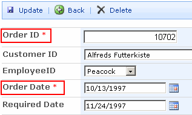  
Required fields  
**  
Default** - (string)  - field by default to register. There are a number of functions that can be used as default values see: **[Functions](http://www.spsprofessional.com/page/SPSRollUp-CAML-Functions.aspx)**  
**DisplayFormat** - (string)  - mask to view the field  See: Formats  

**New** - (string)  Enabled/Disabled/Hidden - - If the field will be active when it will register a new record  
**Edit**  - (string)  Enabled/Disabled/Hidden -  - If the field will be active when it will register a new record  
**View** - (string)  Enabled/Disabled/Hidden - - If the field will be made visual

Enabled - The field is and shows itself active  
Disabled - The field shows itself but it is not enabled  
Hidden - The field doesn’t show itself  

Example; See above  

Edit controls  


### TextBox - Defines a TextBox control

**Attributes:  
Columns** -  (integer) - columns number wide  
**MaxLenght** -  (integer) -  Characters maximum number  
**RightToLeft** - (boolean)  -If you write from right to left


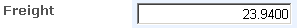  
Example RightToLeft="true"  

Example:

```<TextBox Columns\="40" MaxLenght\="60" RightToLeft\="false" />```


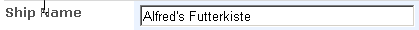  
Example: TextBox  


### Memo – Defines a Memo  control Memo with an enrich text editor


**Attributes:  
Columns** -  (integer) - columns number wide  
**Rows** -  (integer) - rows number  
**MaxLenght** -  (integer) - characters Maximum number  

Example:

```<Memo Columns\="40" Rows\="10" MaxLenght\="300" />```    

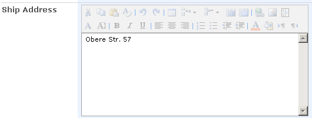  
Example: Memo  


### Date y DateTime – Definition is not available

Nothing to configure here. If you select this control all parameters necessaries

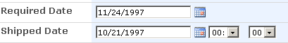

### Lookup – Defines a Memo control with a enrich text editor


**Attributes:  
TextField** -  (string) -  characters Maximum number  
**ValueField** -  (string) - Field that contains the values  
**Table** - (string) – Database field  
**DisplayFormat** - (string) - Format to view text field - See: Formats  

Example:

```<Lookup TextField\="CompanyName" ValueField\="ShipperID" Table\="Shippers" />``` 

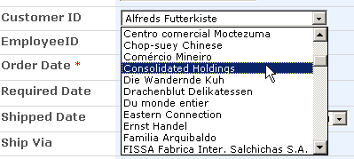  
Example: Lookup  


### ListItems - Define a ListBox or DropDownList control

Inside list items section you can add items. Items are Text, Value pairs. You can use it with the ListBox or DropDownList controls.

**Attributes:  
Text** -  (string) -  Text to display  
**Value** -  (string) - Value to store in the field  
**Selected** - (boolean) – If is the default selected value  

Example:

```<ListItems Multiple\="false"\> <Item Text\="00001-AAAA" Value\="00001" /> <Item Text\="00002-BBBBB" Value\="00002" /> <Item Text\="00003-CCCCC" Value\="00003" Selected\="true" /> </ListItems\>``` 


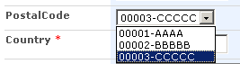  
Example: ListItems as DropDownList Control  


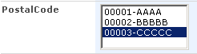  
Example: ListItems as ListBox Control

### ActionGrid Configuration

```
<SPSActionGridConfig xmlns:xsi\="[http://www.w3.org/2001/XMLSchema-instance](http://www.w3.org/2001/XMLSchema-instance)"   
xmlns:xsd\="http://www.w3.org/2001/XMLSchema"\> <DataBase   
ConnectionString\="Data Source=W2K3;Initial Catalog=Northwind;  
Integrated Security=True;User ID=;Password=" /> <Grid Name\=""   
Sortable\="true"   
Pageable\="true"   
PageSize\="10" /> <Query SelectCommand\="SELECT \* FROM \[dbo\].\[Orders\] WHERE CustomerID=@CustomerID" /> <Filter\> <Param Name\="CustomerID" Type\="NChar" Default\="" /> </Filter\> <Columns\> <DataField Name\="OrderID" Header\="OrderID"\> <ContextMenu\> <ContextMenuItem Name\="Select Row" Image\="/\_layouts/images/edititem.gif" Url\="Row" /> </ContextMenu\> </DataField\> <DataField Name\="CustomerID" Header\="CustomerID" /> <DataField Name\="EmployeeID" Header\="EmployeeID" /> <DataField Name\="OrderDate" Header\="OrderDate" /> <DataField Name\="RequiredDate" Header\="RequiredDate"\> <ContextMenu /> </DataField\> </Columns\> </SPSActionGridConfig\>
```


### DataBase - Element for the chain connection configuration

**Attributes:  
**  
**ConnectionString** - (string) - Contains the chain connection to the SQL Server  

Example:

```<DataBase ConnectionString\="Data Source=W2K3;Initial Catalog=Northwind;  
Integrated Security=True;User ID=;Password=" /> 
```

### Grid – Element for the grid configuration

**Attributes:  

Sortable** -  (boolean) true / false - If you are able to sort the grid by clicking on the  columns’ header.  
**Pageable** - (boolean) true/false - If the grid will have pages  
**PageSize** - (integer) - Number of items that will appear on each page  

Example:

```<Grid Sortable\="true" Pageable\="true" PageSize\="10" /> ```

### Query – Element for the database consultation


**Attributes:**  
**  
SelectCommand** - (string) - Sql SELECT Command  
**Cache** - (boolean) true/false - If cache is used to recover/return data- by default it will be true  

Example:

```<Query SelectCommand\="SELECT \* FROM dbo.Customers" />``` 


**Notes:**  
It is appropriate that the SELECT query includes the explicit columns’ names   that we want to show in the grid. We can include columns’ names   that later they will not appear in the grid, however when we connect the grid to another webpart, we will be able to use these columns.

The cache must be false, when we are using a grid alongside with the **ActionEditor** if what we want is that the grid shows the updates once the data is edited.

### Filter – Element for the grid filter

This section is optional and we will use it when we receive data from another webpart to filter the query data (header-lines), if this section is defined we will have to define the parameters too, in the WHERE clause SelectCommand attribute.  

Example:

```<Query SelectCommand\="SELECT Orders.OrderID, Orders.OrderDate, Orders.RequiredDate,   
Employees.FirstName  
FROM Orders   
INNER JOIN Employees ON Orders.EmployeeID = Employees.EmployeeID   
WHERE CustomerID=@CustomerID" /> <Filter\>  <Param Name\="CustomerID" Type\="NChar" Default\="" /> </Filter\>
```

### Param – Element for filter parameters

These parameters are the ones that will appear to us as recipients when we connect this webpart to another. In the SelectCommand attribute from the Query component we will be able to use the parameters as we do in T-SQL.  

**Attributes:**  
**Name** -  (string) - Field’s name (Note: it must be included in WHERE clause with @)  
**Type** - (string)  -  Data type (SQL Server)  
**Default** - (string) - Value by default in case of not receiving data from another webpart. You can use in Default the same functions than in SPSRollUp see: **[Functions](/page/SPSRollUp-CAML-Functions.aspx)**  

Example:

```<Param Name\="CustomerID" Type\="String" Default\="ALFKI" />```   


### Columns – Element for the columns configuration

Example:

<Columns\>  <DataField ... /> </Columns\> 

### DataField – Section for the columns configuration

**Attributes:**  

**Name** -  (string) - Field’s name (Note: it is important that it must be included in SELECT)  
**Header** - (string)  - Title that will appear in the header  
**Format** - (string) - Format that the column will have Formats  

**IsHtml** (boolean) **–** Used to show HtmlEncoded fields.  
**Select** (boolean) **–** If set to true the column display as an Hyperlink, doing click on it the entire row is selected and the values are shipped to the consumers. (**Single click select row**)  

Example:

```<DataField Name\="ContactName" Header\="Contact Name" />```


### DataBase – Connection


**Attributes:  
ConnectionString** - (string) -  Contains the connection chain to the SQL Server  

Example

``` <DataBase ConnectionString\="Data Source=W2K3;Initial Catalog=Northwind;  
Integrated Security=True;User ID=;Password=" \>  
<Table ....\>  
<IdentityColumn .... />  
</Table\> 
</DataBase\>
```  

Contains element: Table


### Table – Element for the configuration of the table that we are going to edit

**Attributes:**  
**Name** - (string) - table’s name that we are going to edit in the database  

Example

```<Table Name\="dbo.Customers"\>  <IdentityColumn Name\="CustomerID" Type\="NChar" /> </Table\>``` 

Contains element: IdentityColumn  

### IdentityColumn – Element for the keys to the table

We will identify each one of the columns through which we will recover a unique table register (usually the columns table entity)  

**Attributes:  
****Name** - (string) -  Column name  
**Type** - (string) – Data type (SQL Server)  
**Incremental** - (boolean) - If it is a field with auto-increase  

Example:

```<Table Name\="dbo.Customers"\> <IdentityColumn Name\="CustomerID" Type\="NChar" Incremental\="false" /> </Table\> ```


### Validations 

At the moment there are 3 types of verifications or validations:

*   by comparison (Compare)
*   by regular expressions (RegExp)
*   by ranges (Range)

We can add more than one verifier to each field so that we can combine these. We will not be able to add two compare verifiers.

### Verifier Compare

Compare a user entry with a constant value or a proprietary value from another control (not yet implemented) through a comparison operator (less than equal to,  more than, among).

The verifier by comparison requires that the attributes are completed:  

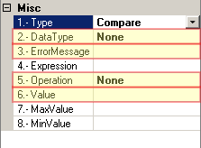

\- **Message** - Text with the error message  
\- **DataType** - data type to be used to verify: Currency, Double, Integer, String, Date.  
\- **Value** - value to be compared to  
\- **Operator** - operation type

The possible operators are:  

\- **DataTypeCheck** - it will check if the entered  data is from the type that was specified in DataType  
\- **Equal** - Compares if the entered value is equal to the value declared in Value  
\- **GreaterThan** - Compares if the entered value  is greater than the value declared in Value   
\- **GreaterThanEqual** - Compares  if the  entered value is greater than or equal to the value declared in Value  
\- **LessThan**  - Compares  if the entered value is less than the value declared in Value  
\- **LessThanEqual**  - Compares  if the entered value is less or equal than the value declared in Value  
\- **NotEqual** - Compares if the entered value is not equal to  the value declared in Value

The result in XML configuration will be something like this.  

```
<Validators\> <Validator Type\="Compare"   
DataType\="Integer" 

ErrorMessage\="Must be greater than 100" 

Operation\="GreaterThan" 

Value\="100" /> </Validators\> 
```


### Verifier- RegExp


Verify that the entry matches a pattern defined by a regular expression. Such verification allows to check predictable character sequences, like social security numbers, email addresses, phone numbers and post codes, among others.

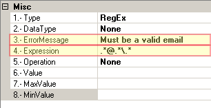

The verifier RegExp requires the completion of the following attributes:  

\- **Message** - Text with the error message  
\- **Expression** - Regular expression to be used to verify

The result in the XML configuration will be something like this.  

```
<Validators\> <Validator Type\="RegEx"   
DataType\="None"   
ErrorMessage\="Must be a valid email"   
Expression\=[.\*@.\*\\.\*](mailto:.*@.*\.*)   
Operation\="None" /> </Validators\> 
```

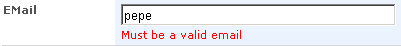  


### Verifier - Range


Verify that a user entry is between the specified upper and lower limits. You can check the intervals between pairs of numbers, dates or alphabetic characters. The limits can be expressed as a constant.

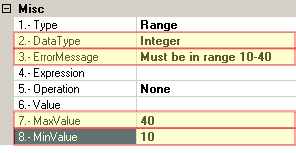

The verifier by comparison requires the completion of the attributes:

\- **Message** - Text with the error message  
\- **DataType** - Data type to be used to verifier:  Currency, Double, Integer, String, Date.  
\- **MaxValue** - Maximum Value  
\- **MinValue** – Minimum Value  

The result in the XML configuration will be something like this.  

```
<Validators\> <Validator Type\="Range"   
DataType\="Integer"   
ErrorMessage\="Must be in range 10-40"   
Operation\="None"   
MaxValue\="40"   
MinValue\="10" /> </Validators\>
```


ActionGrid XML Configuration - Context Menus

The contextual menus are the ones that we can enter and they are similar to those that appear in the SharePoint lists.

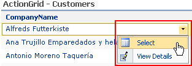

### ContextMenu - Element for the context menu

It gathers the various options that will appear in the contextual menu.  

**Attributes  
Fields** -  (string) -  Fields lists separated by commas  
**Format** - (string)  - Equivalence between identifiers and fields  

These attributes will enable us to transfer data as part of the  (QueryString) url in the context menu options.  

Example:
```
<ContextMenu Fields\="CustomerID" Format\="ID=CustomerID"\>  <ContextMenuItem ... /> </ContextMenu\> 
```
Element Contains: ContextMenuItem  


### ContextMenuItem – Element for the context menu options

**Attributes:  
Name** -  (string) - Description - text that will appear in the menu  
**Image** - (string)  - image Url - ej: /\_layouts/images/edit.gif  
**Url**  -  (string) - URL to which the option will skip, if the Row  value is specified here, when selecting this option, the row will be marked up as what is selected and if we are using this WebPart  as a server all columns specified in the SELECT command will be sent to the consumer webpart.  

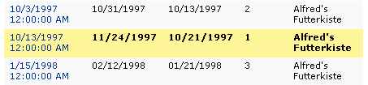  
Sample Selected row  

If we have established values to Fields and Format in the ContextMenu section, we can create Urls that will be able to transfer these values.  

Example:
```
<ContextMenuItem Name\="Select" Image\="/\_layouts/images/list.gif" Url\="Row" /> 
```
Example transferring values declared in the ContextMenu:  
```
<ContextMenuItem Name\="View Details"  
Image\="/\_layouts/images/editicon.gif"  
Url\="TestN2.aspx?ID=%ID%" />  
```
Full example:  
```
<DataField Name\="CompanyName" Header\="CompanyName"\>  <ContextMenu Fields\="CustomerID" Format\="ID=CustomerID"\>  <ContextMenuItem Name\="Select"   
Image\="/\_layouts/images/list.gif" 
Url\="Row" />  <ContextMenuItem Name\="View Details" 
Image\="/\_layouts/images/editicon.gif" 
Url\="TestN2.aspx?ID=%ID%" />  </ContextMenu\> </DataField\>
```
